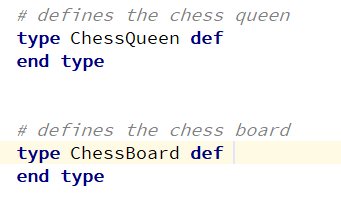
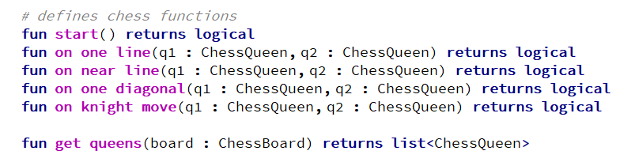

+++
title = "Модель предметной области"
weight = 40
+++

#### Объекты предметной области (домена)

Внутри доменной модели можно создавать типы, используя ключевое слово `type`, а затем использовать объекты этого типа в аргументах доменных функций и семантических предикатов.

#### Доменная функция

Внутри доменной модели можно определить доменные функции с помощью ключевого слова `fun`, а затем использовать эти функции в семантических предикатах.

