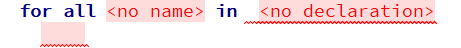
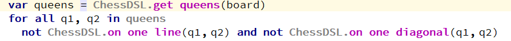
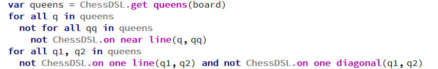

+++
title = "For all (Для каждого)"
weight = 30
+++

Чтобы создать логическое выражение `for all`, необходимо ввести ключевое слово `for`. После этого появится шаблон `for all`.

Общая форма этого логического выражения следующая `for all x1, x2... xn in listX Expression(x1,...,xn)`. Это означает, что для каждого `<x1,..,xn>` из списка `listX` выражение `Expression(x1, ..., xn)` должно быть истинным (`true`).

#### Пример

{}
Для вычисления результата производится выбор различных комбинаций `<x1...xn>` из некоторого списка. Если такой выбор сделать невозможно, считается, что формула не была вычислена, и выражение `for all` возвращает `true`. То есть, если список пуст или имеет меньшую размерность, чем вектор `<x1...xn>`, то в итоге будет получено `true`, однако формула внутри `for all` не будет вычислена.
{}
