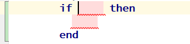
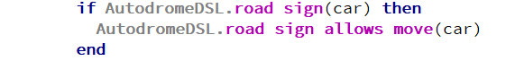

+++
title = "If (импликация)"
weight = 25
+++

Импликация как конструкция `if` в d0sl является `false` только тогда, когда условие является `true`, а часть `then` является `false`. Другими словами, импликация `if(A) then B` является сокращенной записью выражения `not(A) or B`.

{}
Используйте ключевое слово `if`, и редактор предоставит вам шаблон для конструкции `if`.
{}

#### Пример

