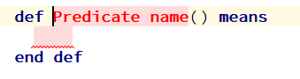

+++
title = "Предикаты"
weight = 15
+++

В математической логике под предикатом принято понимать булевозначную функцию. Однако мы используем расширенное понятие логического типа вместо булевского. И предикат может возвращать три значения: **true**, **false** и **none** (undefined).

{}
Если предикат возвращает **none**, вы должны рассматривать это как исключение. Например, произошел тайм-аут. **none** означает, что предикат не смог вычислить **true** или **false**.
{}

Чтобы создать предикат в семантической модели, необходимо набрать ключевое слово def. Затем появляется шаблон предиката. И вы можете указать имя предиката, его аргументы и тело предиката, которое является логическим выражением.



{}
Имя предиката может содержать пробелы. Также вы можете использовать не только латиницу, но и другие национальные алфавиты ...
{}

{}
Шаблон предиката создается без аргументов. Чтобы добавить аргумент, поместите курсор внутрь круглых скобок и нажмите Enter или Insert.
{}

{}
Тело предиката может быть любым логическим выражением языка d0sl: `and`, `or`, `not`, `check all`, `if`, `for all`.
Но для простоты мы советуем начинать тело предиката с инструкции `check all`. Инструкция `check all` эквивалентна инструкции `and` с большим количеством аргументов, каждый из которых находится в новой строке.
{}

#### Пример определения предиката

```python
def check board(board : ChessBoard) means
  check all
    var queens = ChessDSL.get queens(board)
    for all q1, q2 in queens
      not ChessDSL.on one line(q1, q2) and
      not ChessDSL.on one diagonal(q1, q2)
  end
end def
```
