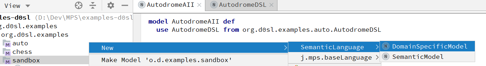

+++
title = "Семантическая и доменная модели"
weight = 5
+++

В d0sl есть два вида корневых документов — семантическая модель и модель предметной области.

Семантическая модель предназначена для определения семантических предикатов и позволяет пользователям определять логические правила.

Модель, специфичная для предметной области, определяет объекты и функции, которые можно использовать в семантической модели, но они специфичны для области предметной области. Это похоже на заголовочный файл C.

Чтобы создать семантическую или доменную модель, откройте контекстное меню, щелкнув правой кнопкой мыши на `sandbox`, а затем выберите new/SemanticLanguage/DomainSpecificModel или new/SemanticLanguage/SemanticModel.



#### Пример Semantic Model

```python
model ChessAII def
  use ChessDSL from org.d0sl.examples.chess.ChessDSL

  def start() means
    check all
      ChessDSL.start()
    end
  end def


  def check board(board : ChessBoard) means
    check all
      var queens = ChessDSL.get queens(board)
      for all q1, q2 in queens
        not ChessDSL.on one line(q1, q2) and
        not ChessDSL.on one diagonal(q1, q2)
    end
  end def

  end def

end ChessAII
```

#### Пример Domain Model

```bash
domain specific model Math def
    # Math library

    # Square root
    fun sqrt(value : numeric) returns numeric

    # Sinus and Cosinus
    fun sin(value : numeric) returns numeric
    fun cos(value : numeric) returns numeric

    # Power function
    fun pow(value : numeric, power : numeric) returns numeric
end Math
```
