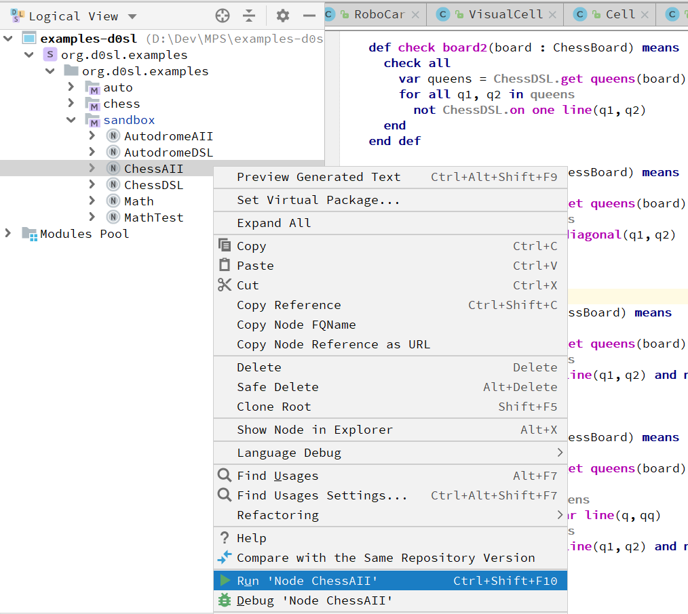

+++
title = "Подробности проекта"
weight = 5
chapter = false
pre = ""
+++

## Чтобы запустить пример с шахматами

- Найдите семантическую модель ChessAII в org.d0sl.examples/sandbox.
- Откройте на ней контекстное меню, нажав правую кнопку мыши. И выберите Run Node ChessAII.



## Чтобы изменить семантику

Семантическая модель определена в песочнице/ChessAII. Когда робот расставляет ферзей, он вызывает предикат `check board`. В семантической модели заранее подготовлено несколько различных предикатов `check board`. Просто измените имя текущего предиката `check board`, а другой (например, `check board1` переименуйте в `check board`. И вы увидите, как меняется поведение робота в зависимости от заданной семантики.

Например, следующая модель запретит роботу ставить ферзей на одну линию, но он сможет расположить их по одной диагонали.

```python
def check board2(board : ChessBoard) means
  check all
    var queens = ChessDSL.get queens(board)
    for all q1, q2 in queens
      not ChessDSL.on one line(q1, q2)
  end
end def
```

{}
После каждого изменения модели не забывайте пересобирать решение MPS (Ctrl+F9).
{}

## Java-часть

Java-часть примера можно найти в org.d0sl.examples/chess

> Прежде всего, обратите внимание на класс ChessDSL, который, используя аннотации, указывает на специфические для домена функции, на которые мы ссылаемся в нашей семантической модели. Например

```java
/**
  Represents a DSL for task: Arrangement of chess queens
 */

@DomainModel(name = "ChessDSL")
public class ChessDSL {
   <...SKIPPED...>
  /**
    Check if two queens are in the same horizontal or vertical
    @param
    @return
   */
  @DomainFunction(name = "on one line")
  public boolean onOneLine(ChessQueen q1, ChessQueen q2) {
    if (q1.getCol() == q2.getCol() || q1.getRaw() == q2.getRaw()) { return true; }
    return false;
  }
  /**
    Check if two queens are in the same diagonal
    @param
    @return
   */
  @DomainFunction(name = "on one diagonal")
  public boolean onOneDiagonal(ChessQueen q1, ChessQueen q2) {
    if (Math.abs(q1.getCol() - q2.getCol()) == Math.abs(q1.getRaw() - q2.getRaw())) { return true; }
    return false;
  }
}
```

После этого, в нашей семантической модели, мы можем указать, в каком классе можно найти реализацию предикатов `on one line` и `on one diagonal`.

```
use ChessDSL from org.d0sl.examples.chess.ChessDSL
```

Также в классе ChessRobot можно найти, как робот вызывает предикат `check board` из семантической модели.

```java
try {
  board.getBoard().setPieces(pieces);
  LogicalConstant check = semantic.callPredicate("check board", board);
  if (check.getValue() != Logical.TRUE) {
    pieces[i][j] = null;
    board.getBoard().setPieces(pieces);
  } else {
    boardPanel.setPiece(pieces[i][j], visit);
    boardPanel.refreshUI();
    if (queenNumber == 7) {
      return true;
    } else {
      if (arrange(pieces, new LinkedList(), queenNumber + 1)) {
        return true;
      } else {
        pieces[i][j] = null;
        board.getBoard().setPieces(pieces);
        boardPanel.clear(visit);
        boardPanel.refreshUI();
      }
    }
  }
} catch (SemanticException e) {
  e.printStackTrace();
}
```

{}
Алгоритм следующий: робот ставит следующего ферзя и спрашивает, все ли хорошо. Если ответ положительный, то робот пытается поставить следующего ферзя, а если ответ отрицательный, то робот убирает последнего ферзя и ищет для него другую клетку. Если возникает ситуация, когда невозможно поставить следующего ферзя ни на одну клетку, робот возвращается на шаг назад, отсекая плохое поле.
{}
