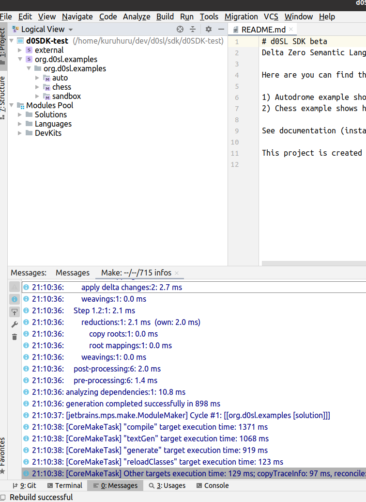

+++
title = "Installation"
weight = 10
+++

1. Install Jetbrains Meta Programming System (MPS) https://www.jetbrains.com/mps/
1. Clone the git repo: 
   ```bash
   git clone https://github.com/d0sl/d0SDK
   ```
2. The first time you start MPS, it displays a project selection window. But you first select the gear at the bottom of Configure/plugins. 
3. Then select install plugin from disk. 
4. Then choose file d0SDK/plugin/0.8.9.2/d0sl-plugin-mps.zip 
5. After installing the plugin, you should see the following: 
6. Open the project in MPS by choosing the directory cloned (e.g. d0SDK directory)
7. Rebuild the project 
8. If everything was successful, you will see the following screen: 