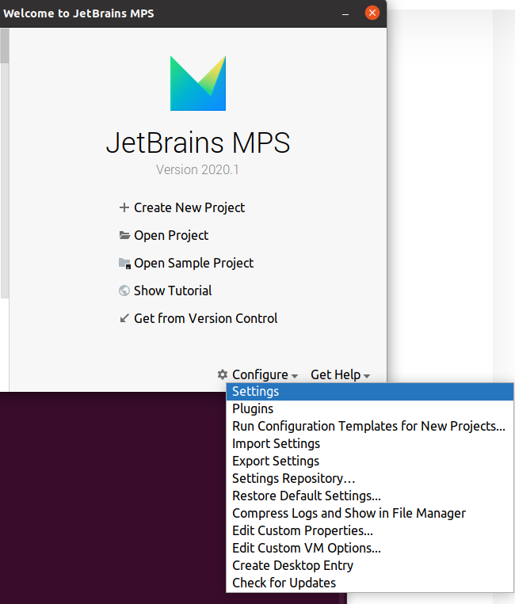
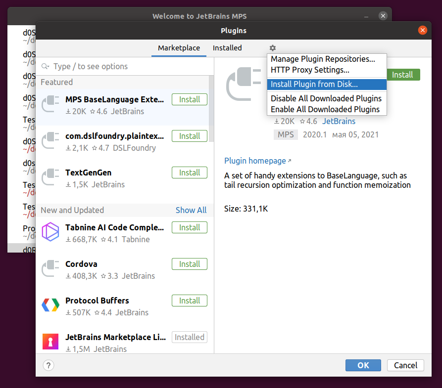
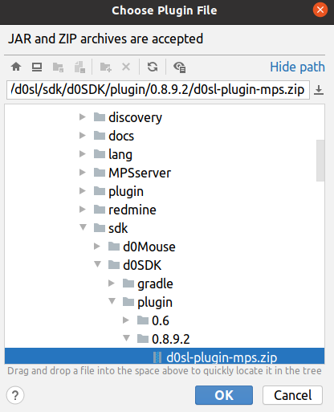
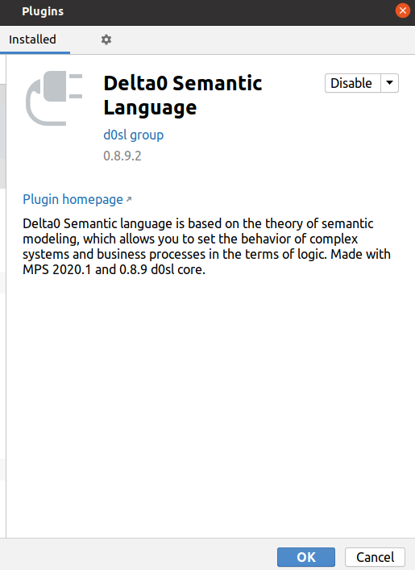
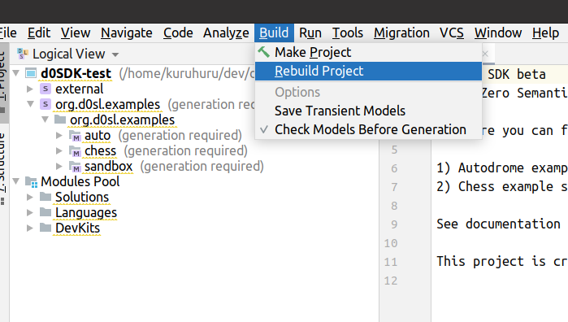
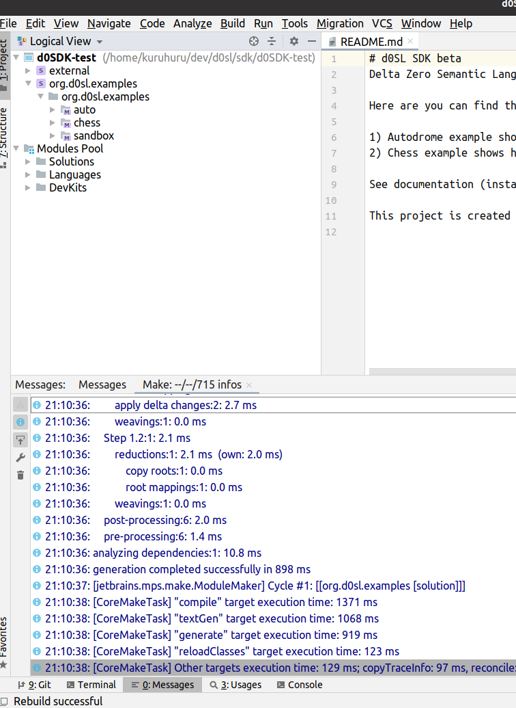

+++
title = "Установка"
weight = 10
+++

1. Установите систему программирования Jetbrains Meta Programming System (MPS) https://www.jetbrains.com/mps/.
1. Клонируйте git-репо:
   ```bash
   git clone https://github.com/d0sl/d0SDK
   ```
1. При первом запуске MPS отображает окно выбора проекта. Но сначала вы выбираете шестеренку в нижней части Configure/plugins.
   
1. Затем выберите установить плагин с диска. 
1. Затем выберите файл d0SDK/plugin/0.8.9.2/d0sl-plugin-mps.zip 
1. После установки плагина вы должны увидеть следующее: 
1. Откройте проект в MPS, выбрав клонированную директорию (например, директорию d0SDK).
1. Пересоберите проект 
1. Если все прошло успешно, вы увидите следующее окно: 
